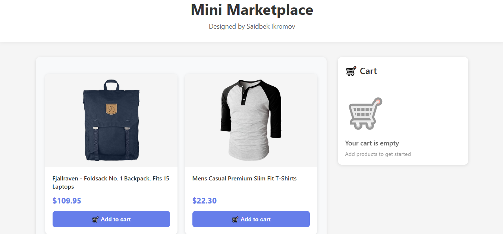
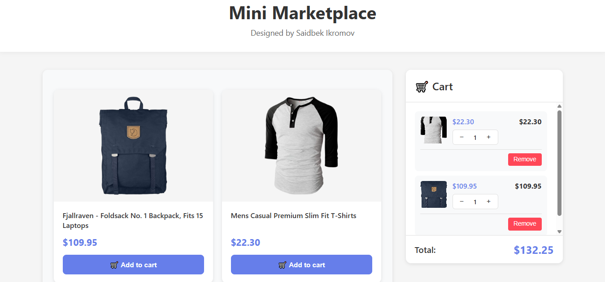
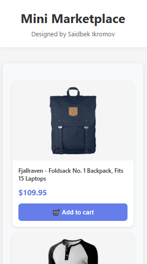
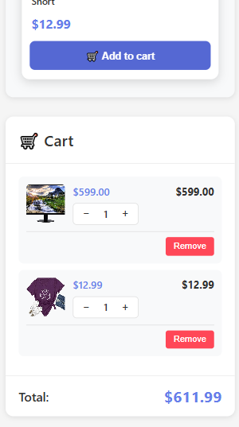

# Mini Shopping Market

A lightweight single‑page shopping experience where products are fetched from **FakeStoreAPI** and users can build a cart with persistent state.

- **Live demo**: `https://mini-marketplace-amber.vercel.app/`
- **Author**: Saidbek Ikromov

## Overview

This project focuses on clean UI, state management, and real-world UX details like persistence and responsive layout.  
One of the most interesting parts is the architecture: **the product catalog is rendered with Vanilla JavaScript**, while the **cart is a React UI**—connected through browser events.

## Key features

- **Product catalog**: browse products loaded from FakeStoreAPI
- **Cart management**: add/remove items, change quantity, and see the total
- **Persistence**: cart is saved to **LocalStorage** and restored on reload
- **Responsive layout**: two-column desktop layout and stacked mobile layout
- **Polished interactions**: custom CSS styling with hover/active states

## Tech stack

- **React** 18.2.0
- **React Router DOM** 6.20.0
- **Vanilla JavaScript** (product catalog rendering)
- **CSS3** (custom styling; no UI libraries)
- **LocalStorage** (cart persistence)
- **FakeStoreAPI** (`https://fakestoreapi.com/products`)

## Architecture notes (what I learned)

- **Vanilla JS + React integration**: I used **Custom Events** to connect the Vanilla JS product catalog with the React cart.
- **Reliable persistence**: syncing cart state with LocalStorage via React `useEffect` helped avoid “stale state” issues on refresh.
- **Responsive UI**: combined Flexbox/Grid to keep layout clean across breakpoints.
- **Cart total visibility**: adjusted the layout so the total section stays accessible even with many items.

## Getting started

Install dependencies:

```bash
npm install
```

Run the app locally:

```bash
npm start
```

Then open `http://localhost:3000`.

## Screenshots

### Desktop


### Desktop (cart filled)


### Mobile


### Mobile (cart filled)


